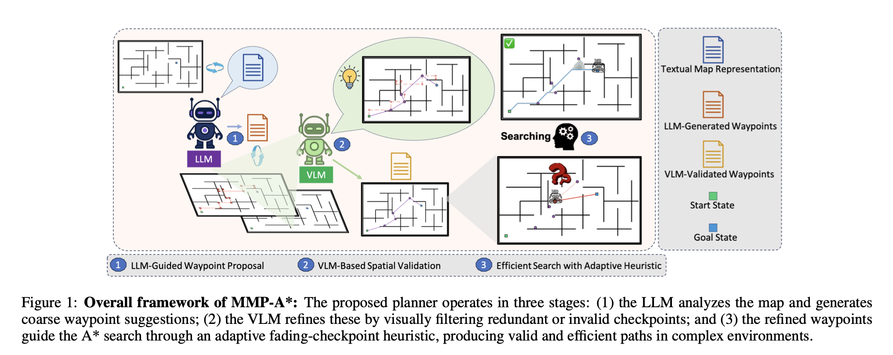
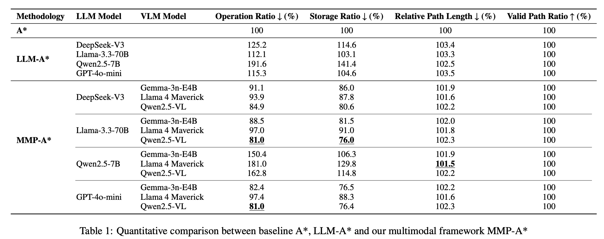
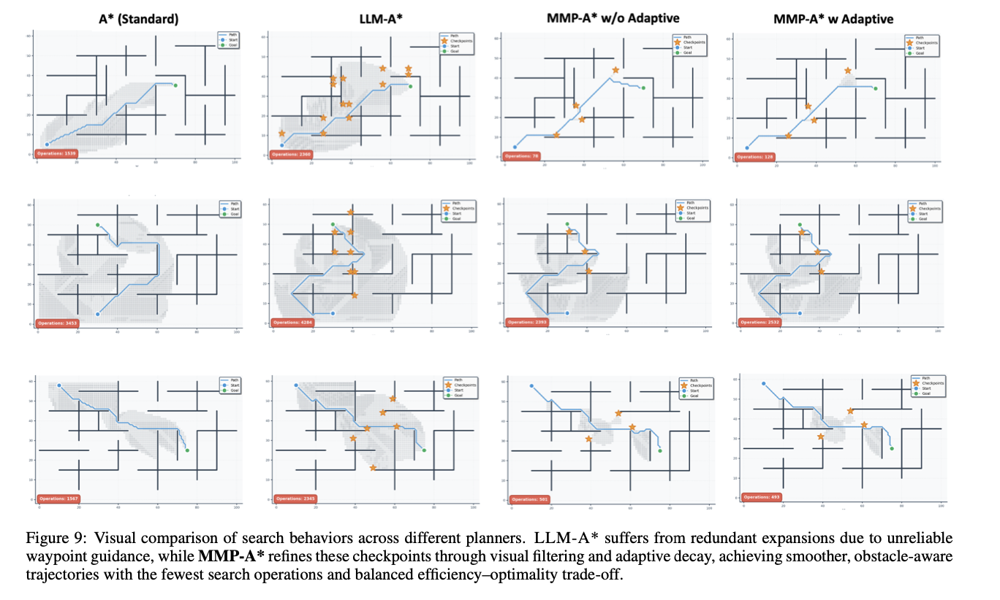

# MMP-A*: Multimodal Perception Enhanced Incremental Heuristic Search on Path Planning


Autonomous path planning requires a synergy between global reasoning and geometric precision, especially in complex or cluttered environments. While classical A* is valued for its optimality, it incurs prohibitive computational and memory costs in large-scale scenarios. Recent attempts to mitigate these limitations by using Large Language Models for waypoint guidance remain insufficient, as they rely only on text-based reasoning without spatial grounding. As a result, such models often produce incorrect waypoints in topologically complex environments with dead ends, and lack the perceptual capacity to interpret ambiguous physical boundaries. These inconsistencies lead to costly corrective expansions and undermine the intended computational efficiency. 
We introduce MMP-A*, a multimodal framework that integrates the spatial grounding capabilities of vision-language models with a novel adaptive decay mechanism. By anchoring high-level reasoning in physical geometry, the framework produces coherent waypoint guidance that addresses the limitations of text-only planners. The adaptive decay mechanism dynamically regulates the influence of uncertain waypoints within the heuristic, ensuring geometric validity while substantially reducing memory overhead. To evaluate robustness, we test the framework in challenging environments characterized by severe clutter and topological complexity. Experimental results show that MMP-A* achieves near-optimal trajectories with significantly reduced operational costs, demonstrating its potential as a perception-grounded and computationally efficient paradigm for autonomous navigation.




## Overview

The system compares the performance of different pathfinding methods:
- **A*** - Traditional A* algorithm (baseline)
- **LLM-A*** - A* enhanced with LLM heuristics
- **LLM-A* (Adaptive)** - LLM-A* with adaptive alpha decay
- **VLM-A*** - A* enhanced with VLM heuristics
- **VLM-A* (Adaptive)** - VLM-A* with adaptive alpha decay

## Setup

### 1. Install Dependencies

```bash
cd llm-astar
pip install -r requirements.txt
```


### 2. Configure API Keys
Here we use the API keys of OpenAI, FPT Cloud, and Together AI for the LLM and VLM models. To adapt your models, you can add a python file in `llm-astar/llmastar/model/` to instantiate the API, and update the `llm` and `vlm` parameters in `main.py`.

Create a `.env` file in the `llm-astar` directory:

```bash
# OpenAI API Key (for ChatGPT)
OPENAI_API_KEY=your_openai_api_key_here

# FPT Cloud API Key (for QWEN, Llama3, DeepSeek)
FPT_API_KEY=your_fpt_api_key_here
FPT_BASE_URL=https://mkp-api.fptcloud.com

# Together AI API Key (for VLM)
TOGETHER_API_KEY=your_together_api_key_here
```

**Note:** The `.env` file is already in `.gitignore` to protect your API keys.

Additionally, create a `.env` file in `llm-astar/llmastar/model/` directory with the same content.

### 3. Prepare Dataset

Ensure your dataset is organized in the following structure:

```
Dataset_name/
├── map_1/
│   ├── query_1.json
│   ├── query_2.json
│   └── ...
├── map_2/
│   ├── query_1.json
│   └── ...
└── ...
```

Available datasets:
- `Dataset` - Full dataset
- `Dataset_demo` - Demo dataset (default)
- `Complex_Dataset` - Complex scenarios with multiple levels
- `Resolution_Dataset` - Resolution testing dataset

## Usage

### Basic Usage

Run the evaluation with default settings:

```bash
cd llm-astar
python main.py
```

This will use:
- LLM: `gpt` (GPT-4o-mini)
- VLM: `meta-llama/Llama-4-Maverick-17B-128E-Instruct-FP8`
- Alpha Decay: `0.9`
- Dataset: `Dataset_demo`
- Prompt: `repe`

### Advanced Usage

Customize the evaluation with command-line arguments:

```bash
python main.py --llm deepseek --vlm meta-llama/Llama-4-Maverick-17B-128E-Instruct-FP8 --alpha_decay 0.9 --dataset_name Complex_Dataset --prompt cot
```

### Command-Line Arguments

| Argument | Type | Default | Choices | Description |
|----------|------|---------|---------|-------------|
| `--llm` | str | `gpt` | `gpt`, `llama3_fpt`, `qwen`, `deepseek` | LLM model to use |
| `--vlm` | str | `meta-llama/Llama-4-Maverick-17B-128E-Instruct-FP8` | `meta-llama/Llama-4-Maverick-17B-128E-Instruct-FP8`, `google/gemma-3n-E4B-it`, `Qwen/Qwen2.5-VL-72B-Instruct` | VLM model to use |
| `--alpha_decay` | float | `0.9` | Any float | Alpha decay factor for adaptive heuristic |
| `--dataset_name` | str | `Dataset_demo` | `Dataset`, `Dataset_demo`, `Complex_Dataset`, `Resolution_Dataset` | Dataset directory to use |
| `--prompt` | str | `repe` | `standard`, `cot`, `repe` | Prompt type to use |


### Performance Metrics

- **Operations**: Number of nodes explored (lower is better)
- **Storage**: Maximum number of nodes stored in memory (lower is better)
- **Length**: Path length from start to goal (lower is better)

All metrics are shown as percentages relative to A* (baseline = 100%)






